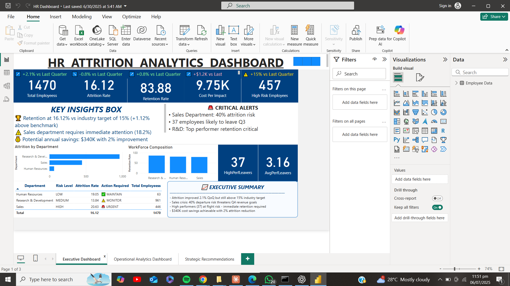
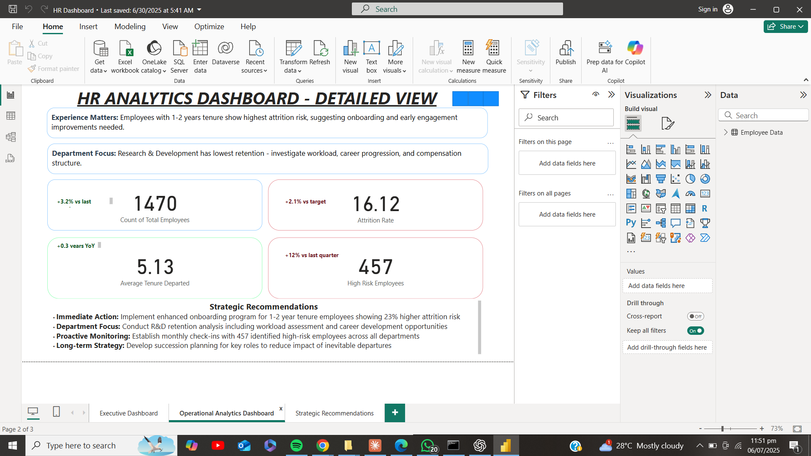
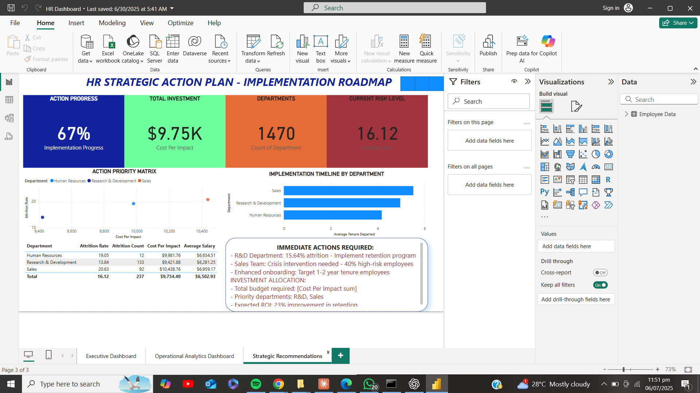

# HR Attrition Dashboard (Power BI)

An interactive Power BI dashboard designed to analyze employee attrition trends and workforce insights. This project helps HR professionals and decision-makers uncover the key drivers of attrition, monitor workforce performance, and support data-driven retention strategies.

---

## 📊 Dashboard Features

The dashboard is structured into **3 strategic pages**:

### 1. Executive Dashboard
- Overall attrition rate
- Headcount and attrition trends
- Department-wise and gender-based breakdown

### 2. Operational Analytics Dashboard
- Attrition by age, overtime, and job satisfaction
- Attrition rate by years at company and job level
- KPI cards and HR segment performance metrics

### 3. Strategic Recommendations
- Insights-based recommendations
- Data-driven actions to reduce employee turnover

---

## 📁 Dataset

> 📌 The dataset used is a public HR analytics dataset for learning purposes.  
> Source: [IBM HR Analytics Employee Attrition & Performance](https://www.kaggle.com/datasets/pavansubhasht/ibm-hr-analytics-attrition-dataset)

- Format: `.csv`
- Records: ~200+
- Key columns: `Attrition`, `Age`, `Gender`, `JobRole`, `OverTime`, `JobSatisfaction`, `YearsAtCompany`, `Department`, `JobLevel`, etc.

---

## 🛠 Tools & Technologies

- **Power BI** – Dashboard design, interactivity, and publishing
- **DAX** – Calculated columns and measures
- **Power Query** – Data transformation
- **GitHub** – Project versioning and showcase

---

## 📷 Screenshots

### Executive Dashboard  

---

### Operational Analytics Dashboard  

---

### Strategic Recommendations  

---

## 🚀 How to Use

1. Clone or download this repository.
2. Open `HR Dashboard.pbix` using Power BI Desktop.
3. Make sure the dataset (CSV) is in the correct path, or relink it in Power BI.
4. Explore the three dashboard pages to gain insights.

---

## 📌 Key Insights

- **Overtime and low job satisfaction** strongly correlate with high attrition.
- **Employees under 30** show higher churn rates.
- **Sales and HR** departments experience the most turnover.
- Retention efforts should target specific job levels and satisfaction metrics.

---

## 🤝 Acknowledgments

- [Kaggle - IBM HR Analytics Dataset](https://www.kaggle.com/datasets/pavansubhasht/ibm-hr-analytics-attrition-dataset)
- Microsoft Power BI Community

---

## 📬 Contact

**Muftawu Nurudeen**  
[LinkedIn](#) | [GitHub](https://github.com/mfdeenn) | [Email](#)

---

